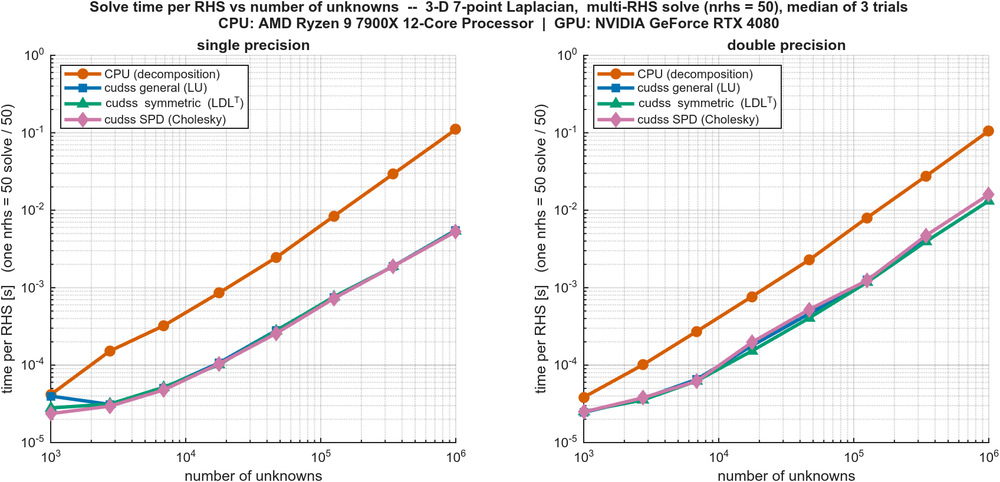
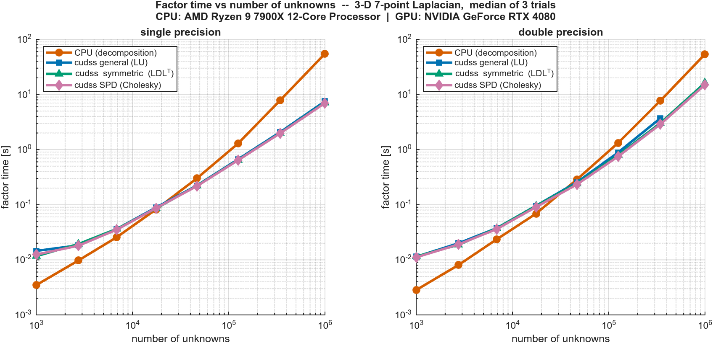

# cuDSS-matlab-connector — MATLAB wrapper around NVIDIA cuDSS

> **Heads up: most of this codebase was generated by an LLM.** It has been
> thoroughly tested (see `test_cudss_solver.m` — correctness across
> precisions, matrix types, lifecycle/leak regressions, async factor,
> singular-matrix detection) but I think you should be aware. PRs welcome.

A factor-once / solve-many sparse direct solver for large non-symmetric
systems on the GPU.  The factorization is held in device memory across
many right-hand-side blocks, so the analysis + numeric-factorization
cost is paid exactly once per matrix.

Designed for workloads that assemble a sparse `K` and then apply its
factor to many right-hand-side blocks (e.g. time-stepping simulations,
multi-load-case finite-element solves, iterative refinement loops).
Provides single precision speedups of up to **21x** and double precision 
speedups of up to **8x**.

---

## Performance

`test_performance.m` is a side-by-side benchmark of `cudss.factor` /
`cudss.solve` against MATLAB's host `decomposition` on a 3-D 7-point
Laplacian.  Sweep is `n = N^3` for `N` in
`{10, 14, 19, 26, 36, 50, 70, 100}`, i.e. `K` is `n × n` sparse with
`n` ranging from 1,000 to 1,000,000 unknowns (rows of `K`).  "Matrix
size" in the plots is **`n`, the number of unknowns / number of rows
of `K`**.

Each subplot draws four lines per precision:

- **CPU (decomposition)** — MATLAB's host sparse-direct solver
  (CHOLMOD-backed for SPD `K`).
- **cudss general (LU)** — `cudss.factor` with `matrix_type='general'`.
  Makes no symmetry assumption; uploads the full nnz to the device.
- **cudss symmetric (LDLᵀ)** — `matrix_type='symmetric'`.  Uploads
  only `triu(K)`.
- **cudss SPD (Cholesky)** — `matrix_type='spd'`.  Same upload halving
  as symmetric, with the SPD-specific factor path.

Each precision is benchmarked separately:

- **Factor**: median of 3 independent factor calls, reported in
  seconds.
- **Solve**: one multi-RHS solve of `K * W = L` with `L` an `n × 50`
  dense block, then divided by 50 to give a per-RHS time.  This is
  the workload cuDSS is built for: factor once, then apply the
  cached factor to a multi-column right-hand-side in a *single*
  triangular-solve launch that shares back-substitution work across
  columns. 

Run with:

```matlab
run('test_performance.m')   % writes plots + .mat into assets/
```

Results below are from an **AMD Ryzen 9 7900X** (12 cores) vs an
**NVIDIA GeForce RTX 4080**.

### Solve time (per RHS, from one nrhs = 50 multi-RHS solve)



cuDSS wins on per-RHS solve time across essentially the whole range.
At very small `n` (~10³) the GPU and CPU are within a factor of two;
past `n ≈ 10⁴` cuDSS pulls clearly ahead.  The three `matrix_type`
variants are within a few percent of each other on this SPD matrix.
At `n = 10⁶` the per-RHS speedup of the fastest cuDSS variant vs the
host is roughly **21× in single** and **8× in double**.

### Factor time



`cudss.factor` carries a ~10 ms fixed cost (CUDA + cuDSS driver init,
device allocations, METIS-style reordering), so the host wins for `n`
below ~3 × 10⁴.  Past that, the GPU pulls ahead: at `n = 10⁶` the
fastest cuDSS variant factors in about **7.0 s in single** and
**15.0 s in double**, vs ~54 s on the host — roughly **8×** and
**3.6×** speedups respectively.

The three GPU variants overlap for moderate `n` (the 3-D Laplacian is
SPD, so cuDSS finds essentially the same fill pattern under any
matrix_type), then diverge at large `n` where memory becomes the
binding constraint.  In double precision at `n = 10⁶` the **`general`
LU path runs out of device memory**, so its line stops at `n = 343,000`
in the right-hand panel.  `symmetric` and `spd` still fit because
they upload only the upper triangle of `K` and use the
symmetric / SPD factor representation — a concrete reason to declare
symmetry to cuDSS whenever `K` has it.

Note that MATLAB's `decomposition` does not run faster in single
precision on this CPU, so the single and double CPU lines lie on top
of each other.  cuDSS runs a genuine FP32 path that does benefit, so
the single/double GPU gap is visible in both plots.

---

## What this project contains

```
cudss-matlab-connector/
├── README.md                   <- this file
├── build_mex.m                 <- compile the MEX (run once after install)
├── test_cudss_solver.m         <- correctness + lifecycle test suite
├── test_performance.m          <- benchmark vs MATLAB CPU solver
├── assets/                     <- benchmark plots + raw timings
├── +cudss/                     <- MATLAB-facing package (call these)
│   ├── factor.m                <- handle = cudss.factor(K, opts)
│   ├── solve.m                 <-      W = cudss.solve(handle, L)
│   ├── wait.m                  <- cudss.wait(handle)
│   ├── destroy.m               <- cudss.destroy(handle)
│   ├── internal_handle_registry.m   <- internal; do not call directly
│   └── private/                <- compiled MEX binary lands here
└── mex/                        <- C++/CUDA source for the MEX
    ├── cudss_solver.cu         <- the only .cu compiled; dispatcher entry
    ├── solver_state.hpp        <- per-handle state (RAII over cuDSS objects)
    └── class_handle.hpp        <- uint64 <-> C++ pointer marshalling
```

A user only ever calls things in `+cudss/`.  The MEX binary in
`+cudss/private/` is a single dispatcher and is invoked via a command
string (`'factor'`, `'solve'`, `'wait'`, `'destroy'`) from each
wrapper.

---

## What it does, in one paragraph

NVIDIA's cuDSS library factors a sparse matrix `K` on the GPU and
solves `K * W = L` for dense right-hand-side blocks against the
factor.  This wrapper hides the lifecycle (allocate, upload, analyze,
factor, solve, free) behind four MATLAB functions and a `uint64`
opaque handle.  All numeric work happens on the device; both `L` and
`W` are `gpuArray`s with no implicit host round-trip.  The factor and
all associated cuDSS state are pinned in GPU memory until you call
`cudss.destroy(handle)`.

Internally:
- The MATLAB sparse `K` is transposed in MATLAB (because MATLAB stores
  CSC and cuDSS expects CSR, and `CSC(K') == CSR(K)`).
- The MEX uploads CSR row offsets, column indices, and values into
  device buffers and creates a cuDSS sparse matrix descriptor.
- cuDSS runs ANALYSIS (METIS-style reordering + symbolic factor) and
  FACTORIZATION (numeric LU) on the GPU.  These can run synchronously
  or async on a worker thread.
- Each `cudss.solve` wraps `L` and `W` as cuDSS dense matrices and
  fires `cudssExecute(SOLVE)` on the solver's dedicated CUDA stream.
- `cudss.destroy` releases the matrix descriptor, factor data, cuDSS
  handle, stream, and all device buffers in reverse order.

The matrix type defaults to `CUDSS_MTYPE_GENERAL` (full LU, no symmetry
assumption). Callers with a symmetric or symmetric-positive-definite `K` can pass
`opts.matrix_type = 'symmetric'` (LDLᵀ) or `'spd'` (Cholesky) to get
cuDSS's faster, lower-memory factorization path — see the Options struct
below.

---

## Requirements

This wrapper has been tested **only** with the following stack. Other
versions may work but are unsupported.

- **Ubuntu 22.04 and 24.04** — while this code should work on Windows, it has not been tested
- **MATLAB R2024b or newer** — required for native single-precision sparse
  support. Older releases are rejected by `build_mex`.
- **CUDA Toolkit 12** — must match cuDSS 0.7.1 and MATLAB
- **NVIDIA cuDSS 0.7.1** — install following the official
  [cuDSS getting started guide](https://docs.nvidia.com/cuda/cudss/getting_started.html).
  **Before running `build_mex`, verify your cuDSS install works by building
  and running example 1 (`simple`) from the
  [NVIDIA CUDALibrarySamples cuDSS examples](https://github.com/NVIDIA/CUDALibrarySamples/tree/master/cuDSS/simple).**
  If that example does not build or run cleanly on your machine, this
  wrapper will not either — the wrapper is a thin shim over the same APIs.
- **A working `gpuDevice()`** (or pass `'Arch', 'sm_XY'` to `build_mex`
  explicitly on a build-only host).

The build script looks for cuDSS in this order:
  1. `'CudssPath'` name/value argument to `build_mex`
  2. `CUDSS_PATH` environment variable
  3. Platform default — Linux: `/usr`, `/usr/local/cudss` (or
     `/opt/nvidia/cudss/0.7`); Windows: `C:\Program Files\NVIDIA cuDSS\v0.7`

---

## Build

From MATLAB, with this directory on the path:

```matlab
build_mex                                 % auto-detects everything
build_mex('CudssPath', '/usr/local/cudss')% override the cuDSS install
build_mex('Arch', 'sm_89')                % override the GPU arch
build_mex('Debug', true)                  % -G -O0 line-level CUDA debug
build_mex('Clean', true)                  % wipe prior binary first
```

The build produces a single MEX binary
`+cudss/private/cudss_solver.<mexext>`.  All four `cudss.*`
functions call into it via the command-string dispatcher.

On Linux, if `libcudss.so` is not on `LD_LIBRARY_PATH` at MATLAB
launch time, the build prints a one-line reminder of the `export`
command needed.

---

## Quick start

```matlab
% K is an n x n sparse, real, square matrix (single or double).
% The default makes no symmetry assumption and factors via general LU;
% pass opts.matrix_type to select symmetric LDL^T or SPD Cholesky.
handle  = cudss.factor(K);                       % defaults to FP32, general LU
cleanup = onCleanup(@() cudss.destroy(handle));  % fires when `cleanup` is destroyed (function return, error, Ctrl+C, or `clear cleanup`)

L_gpu = gpuArray(single(L));                     % n x nrhs RHS block
W_gpu = cudss.solve(handle, L_gpu);              % K * W = L on the GPU
W     = gather(W_gpu);                           % back to host if needed
% At end of enclosing function (or `clear cleanup` in a script) the handle is destroyed.
```

`cudss.solve` requires `L` to already live on the GPU and to match the
factor's precision.  Pass a host array and you get a clean error
asking you to `gpuArray(single(L))` (or `gpuArray(double(L))`)
yourself.

---

## Options struct

```matlab
opts = struct( ...
    'precision',   'single',   ...  % 'single' (default) or 'double'
    'matrix_type', 'general',  ...  % 'general' (default) | 'symmetric' | 'spd'
    'async',       false,      ...  % true: queue analysis + factor and return
    'verbose',     false,      ...  % per-phase ms timing printouts
    'reordering',  'default');      % only 'default' is honored today

handle = cudss.factor(K, opts);
```

- `precision` must match `class(K)`.  Pass a `single` sparse with
  `'single'` and a `double` sparse with `'double'`.
- `matrix_type` selects the cuDSS matrix type / factor path:
  - `'general'` — `CUDSS_MTYPE_GENERAL`, full LU.  No symmetry assumed.
  - `'symmetric'` — `CUDSS_MTYPE_SYMMETRIC`, LDLᵀ.  K must be symmetric.
  - `'spd'` — `CUDSS_MTYPE_SPD`, Cholesky.  K must be symmetric positive
    definite (a non-PD K will surface as `cudss:NumericalError` from a
    non-zero `CUDSS_DATA_INFO` during factorization).

  For `'symmetric'` and `'spd'`, the wrapper extracts `triu(K)` before
  transposing, so only the upper triangle is transferred to and stored on
  the device (~half the CSR nnz vs `'general'`).  **Symmetry is NOT
  validated** — if K is not actually symmetric, the solve silently uses
  `triu(K)` and treats the lower triangle as `triu(K)^T`.  The caller is
  responsible for the declaration being true.
- `async=true` is the right choice when you have unrelated GPU or CPU
  work to do between the factor request and the first solve — see
  **Overlapping factor with other work** below.
- `verbose=true` prints a ms breakdown for sparse cast / transpose /
  H2D / cuDSS analysis / cuDSS factorization.  Useful for finding
  where time goes when you first integrate the solver.

---

## Async factor + `cudss.wait`

Most cuDSS factor cost is **host-side**: METIS reordering and symbolic
factor are single-threaded inside cuDSS and can take O(seconds) on
large meshes.  When you have unrelated work to do (other GPU kernels
on a different stream, CPU bookkeeping, I/O), `opts.async = true`
overlaps the two:

```matlab
handle = cudss.factor(K, struct('precision','single','async',true));

%% ... do unrelated GPU / CPU work here ...

cudss.wait(handle);   % drain anything the unrelated work didn't cover
W = cudss.solve(handle, L_gpu);
```

`cudss.solve` on the same handle is also safe without an explicit
`cudss.wait` — it queues behind the factor on the same CUDA stream
and defensively joins the worker thread before reading the result.
Calling `cudss.wait` first is purely for observability (to time the
*residual* factor cost that overlap didn't hide).

---

## Cleanup pattern with `onCleanup`

Errors, `Ctrl+C`, and `return`s inside a factor-per-iteration loop must
not leak the cuDSS handle. `destroy` must be called before clearing `h` or
GPU memory will not be freed.

```matlab
function cleanup_cudss(h_K)
    % Bound to an onCleanup so cudss.destroy fires on any scope exit
    % (normal end-of-iteration, error, Ctrl+C).  cudss.destroy is
    % idempotent and warns on a stale handle; suppress that single
    % warning ID so a clean shutdown stays silent.
    prev_warn = warning('off', 'cudss:AlreadyDestroyed');
    restorer  = onCleanup(@() warning(prev_warn)); %#ok<NASGU>
    try
        cudss.destroy(h_K);
    catch ME_K
        warning('cudss:CleanupFailed', ...
                'cudss.destroy(handle_K) failed during cleanup: %s', ...
                ME_K.message);
    end
end
```

Inside a per-iteration loop:

```matlab
for k = 1:num_iters
    % --- IMPORTANT: clear the previous iteration's cleanup BEFORE issuing
    %     the new factor.  Otherwise the assignment of cleanup_K fires the
    %     prior destructor AFTER the new factor has been allocated, peaking
    %     at ~2x steady-state GPU footprint.  Clearing first keeps peak ==
    %     steady-state.
    if exist('cleanup_K', 'var')
        clear cleanup_K
    end

    handle_K  = cudss.factor(K_k, struct('precision','single','async',true));
    cleanup_K = onCleanup(@() cleanup_cudss(handle_K));

    % ... unrelated GPU/CPU work runs concurrently with the async factor ...

    cudss.wait(handle_K);                 % optional, for timing only
    W_gpu = cudss.solve(handle_K, L_gpu); % per-RHS solves
    % ... no explicit destroy needed; cleanup_cudss fires next iteration
end
```

Why this works:

- `cleanup_K` holds the only reference to the `onCleanup` object.  When
  that variable is overwritten or cleared, MATLAB fires the cleanup
  callback.  Any path out of the loop body (normal iteration end, `error`,
  `Ctrl+C`, `return`) destroys the object.
- The explicit `clear cleanup_K` BEFORE the next factor is what guarantees
  the steady-state memory profile.  Without it, MATLAB still has the old
  `onCleanup` alive when the new factor allocates, so peak ≈ 2 ×
  steady-state.
- `cudss.destroy` is idempotent, so a clean end-of-script destroy
  followed by the `onCleanup` firing again is a no-op (modulo the
  one warning, which the wrapper suppresses).

There is no obligation to use `onCleanup` — a plain `cudss.destroy`
at the end of a function is fine for one-shot use.  But for any loop
where the body can error, `onCleanup` is what keeps GPU memory honest.

---

## Lifecycle invariants

- A `uint64` handle is valid from the moment `cudss.factor` returns
  until `cudss.destroy(handle)` is called.  Anything else (using a
  destroyed handle, or a `uint64` not produced by `cudss.factor`) is
  rejected by the MATLAB-side registry with `cudss:InvalidHandle`.
- `cudss.destroy` is idempotent.  A second destroy emits
  `cudss:AlreadyDestroyed` and returns.
- If MATLAB unloads the MEX (`clear cudss_solver`, `clear mex`, or
  MATLAB exit) while a factor is still live, the MEX's `mexAtExit`
  hook walks an internal ledger and destroys each handle so cuDSS
  resources are not orphaned.
- The MEX is `mexLock`-ed while at least one handle is live, so
  `clear mex` cannot unload it under your feet between
  `cudss.factor` and `cudss.destroy`.

---

## Errors you might see

| Error ID                          | Meaning |
|-----------------------------------|---------|
| `cudss:BadInput`                  | Input failed shape/type validation (not sparse, not square, wrong dimensions, etc.). |
| `cudss:WrongInputType`            | Class of `K` or `L` does not match `opts.precision` / the handle's precision. |
| `cudss:BadOpts`                   | `opts` struct has an unrecognized value (e.g., bad precision string). |
| `cudss:InvalidHandle`             | `uint64` passed to `solve`/`wait` is not in the live registry. |
| `cudss:AlreadyDestroyed`          | (warning) destroy called on a stale handle; no-op. |
| `cudss:NumericalError`            | cuDSS returned success but reported a non-zero `CUDSS_DATA_INFO` (typically zero/negative pivot) — matrix is likely singular, or `matrix_type='spd'` was used on a non-PD K. Same ID from sync and async factor paths. |
| `cudss:CudssError`                | A cuDSS API call failed; full status name + numeric code are in the message. |
| `cudss:CudaError`                 | A CUDA Runtime call failed; `cudaError` name + numeric code are in the message. |
| `cudss:Error`                     | Catch-all for unexpected exceptions raised during factor construction (CUDA or cuDSS failures inside the exception-safe path that aren't already classified above). |
| `cudss:UnsupportedMATLAB`         | `build_mex` rejected the MATLAB release (need R2024b+). |
| `cudss:BuildPath`                 | `build_mex` could not find `cudss.h` / `libcudss.*` under the resolved cuDSS path. |

---

## Testing

`test_cudss_solver.m` is a self-contained correctness suite:
small smoke tests, multi-RHS correctness, a 3-D 7-point Laplacian,
factor-once / solve-many, precision dispatch,
wrong-precision rejection, handle lifecycle, double-destroy, async
factor, `matrix_type` agreement across general/symmetric/spd, SPD
rejection of indefinite K, lock-counter regression, singular-matrix
detection, and cross-stream interleaving.  Run from MATLAB after
`build_mex`:

```matlab
addpath(pwd);
run('test_cudss_solver.m');
```
